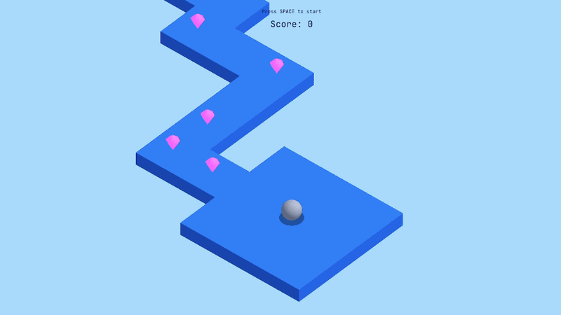

# ZigZag

A ZigZag-style game module built on top of [OpenGLEngine](https://github.com/GorkyD/OpenGLEngine) (a custom ECS-based OpenGL engine). This folder is self-contained and meant to be dropped into any `OpenGLEngine` checkout under `OpenGLEngine/Game/`.

This project is a port/copy of my old Unity test project — [GorkyD/ZigZag](https://github.com/GorkyD/ZigZag) — reimplemented from scratch on top of OpenGLEngine's ECS.

## Gameplay

- The ball moves forward automatically, speeding up the longer you survive.
- Press `Space` to switch direction (straight <-> right turn) at the next tile.
- Collect pink crystals for score, plus score for distance traveled.
- Falling off the path ends the run; press `Space` to restart.

## Structure

- `Context/` — `ZigZagContext`, shared config and runtime state passed into every state/system.
- `GameState/` — `GameStateMachine` plus the states: `PreStartState`, `PlayingState`, `GameOverState`.
- `Systems/` — gameplay systems: tile spawning/pooling, ball movement, crystal spawning, particle bursts, camera follow, shadows, score.
- `Services/` — supporting services: `EnvironmentService` (lighting/platform), `HudService` (UI text).
- `Components/` — ECS components specific to ZigZag (`ZigZagBallComponent`).
- `ZigZagScene.h` / `ZigZagScene.cpp` — thin orchestrator implementing `IScene`, wires all systems/services together and owns the state machine.

## Integrating into an OpenGLEngine checkout

1. Copy or clone this folder into `OpenGLEngine/Game/` of an [OpenGLEngine](https://github.com/GorkyD/OpenGLEngine) checkout (e.g. `OpenGLEngine/Game/ZigZag OpenGL`).
2. The root `CMakeLists.txt` auto-discovers every `.cpp` file and subfolder under `OpenGLEngine/Game/`, so no manual CMake edits are needed.
3. Point `OpenGLEngine/Game/main.cpp` at `ZigZagScene` (`#include "ZigZagScene.h"` and `engine.LoadScene(std::make_unique<ZigZagScene>())` or equivalent).
4. Build and run as usual (see the engine's own `README.md` for toolchain setup).

## Save data

Best score is persisted through the engine's `SaveService`. See the engine README/save file location for details.
